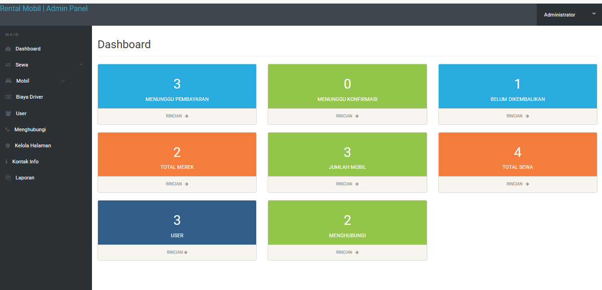
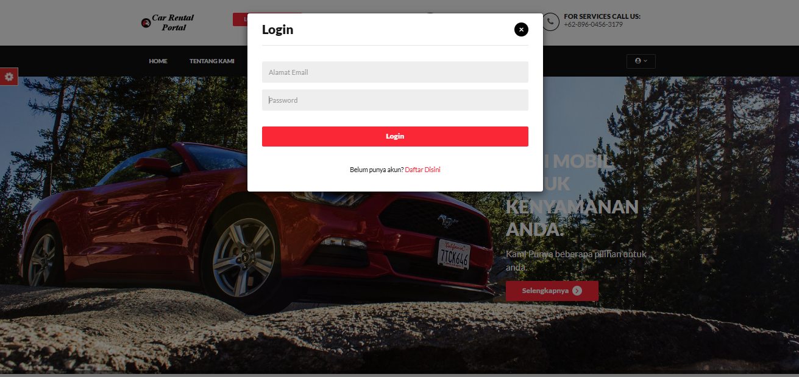
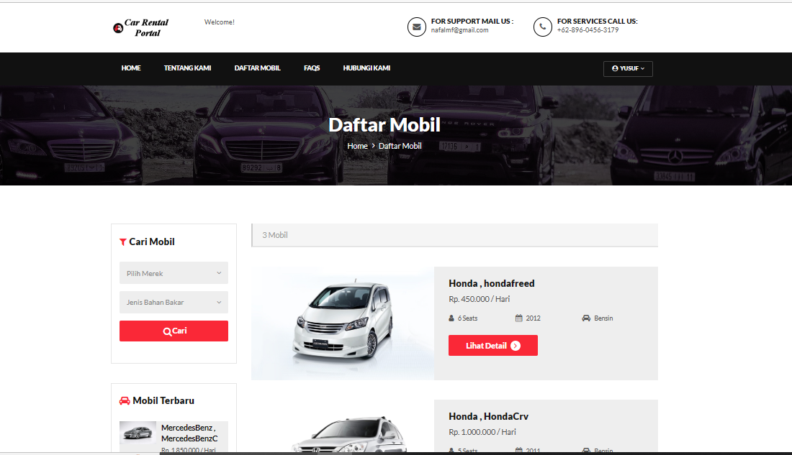
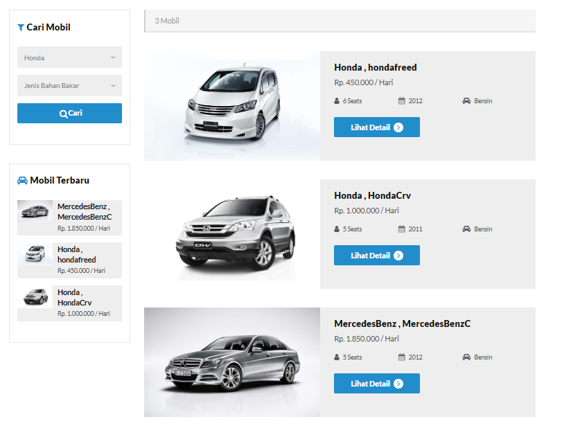
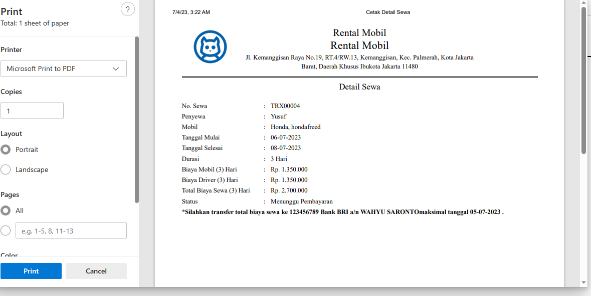

# Aplikasi Sistem Informasi Rental Mobil Berbasis Web

## Deskripsi

Aplikasi Sistem Informasi Rental Mobil Berbasis Web memberikan solusi yang efisien dan mudah digunakan untuk peminjaman mobil. Dengan aplikasi ini, pengguna dapat dengan cepat mencari, memilih, dan menyewa mobil yang sesuai dengan kebutuhan mereka. Aplikasi ini juga memberikan kemudahan bagi penyedia layanan rental mobil untuk mengelola inventaris mobil, mengatur pemesanan, dan melacak riwayat transaksi.
dibangun dengan menggunakan (codeigniter4).

# Biodata Anggota Kelompok 3

## Judul Project : [ RENTAL MOBIL ]

### Anggota Kelompok Kelas TI.21.A.2 :

1. [Nafal Mumtaz Fuadi]
   - NIM: [312110457]
   - kelas : TI.21.A.2
   - Peran: [Ketua Kelompok]

2. [Gilang Rizki Bahtiar]
   - NIM: [312110106]
   - kelas : TI.21.A.2
   - Peran: [Anggota Kelompok ]

3. [Fauzi Farhansyah]
   - NIM: [312110092]
   - kelas : TI.21.A.2
   - Peran: [Anggota Kelompok ]

4. [M Farhan Atila]
   - NIM: [312110366]
   - kelas : TI.21.A.2
   - Peran: [Anggota Kelompok]

5. [AHMAD RIDHO]
   - NIM: [312110279]
   - kelas : TI.21.A.2
   - Peran: [Anggota Kelompok]
  
     
### Deskripsi Singkat Kelompok:

[Keterangan singkat tentang kelompok dan tujuan proyek yang sedang dikerjakan adalah menyelesaikan Tugas Matkul Program web2]

## Fitur

- Pendaftaran pengguna baru: Pengguna dapat mendaftar akun baru dengan mengisi formulir pendaftaran.
- Login dan autentikasi pengguna: Pengguna dapat masuk ke akun mereka dengan menggunakan email dan kata sandi yang terdaftar.
- Penyewaan mobil: Pengguna dapat melihat daftar mobil yang tersedia dan melakukan pemesanan.
- Pencarian mobil berdasarkan kategori, harga, dll.: Pengguna dapat mencari mobil berdasarkan kriteria tertentu, seperti kategori, harga, atau lokasi.
- Melihat informasi detail mobil: Pengguna dapat melihat informasi lengkap tentang mobil, termasuk deskripsi, gambar, spesifikasi, dan harga.
- Melakukan reservasi mobil: Pengguna dapat memilih tanggal dan waktu sewa untuk melakukan reservasi mobil.
- Mengelola pemesanan dan pembatalan: Pengguna dapat melihat dan mengelola pemesanan mereka, termasuk melakukan pembatalan jika diperlukan.
- Melihat riwayat transaksi: Pengguna dapat melihat riwayat transaksi mereka, termasuk detail pembayaran dan status pemesanan sebelumnya.
- Mengelola profil pengguna: Pengguna dapat mengubah informasi profil mereka, seperti alamat, nomor telepon, dan preferensi kontak lainnya.

## Tampilan Aplikasi

# Dashboard Admin

# Menu Login User

# Menu Daftar mobil

# Menu Pencarian Mobil

# Menu Cetak Pembayaran

# Rental-Mobil
Rental Mobil Berbasis website ini memiliki tampilan yang sederhana dan fitur yang mampu berfungsi dengan baik.

To access admin page, add url /admin. Example : https://rentalmobilbekasi.my.id/

## Link Application
WEBSITE : https://rentalmobilbekasi.my.id/

## SEKIAN TERIMAKASIH

 
